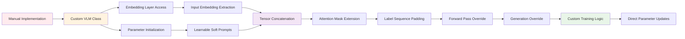

```mermaid
graph LR
    A[Manual Implementation] --> B[Custom VLM Class]
    B --> C[Embedding Layer Access]
    B --> D[Parameter Initialization]

    C --> E[Input Embedding Extraction]
    D --> F[Learnable Soft Prompts]

    E --> G[Tensor Concatenation]
    F --> G

    G --> H[Attention Mask Extension]
    H --> I[Label Sequence Padding]

    I --> J[Forward Pass Override]
    J --> K[Generation Override]

    K --> L[Custom Training Logic]
    L --> M[Direct Parameter Updates]

    style A fill:#ffebee
    style B fill:#fff3e0
    style G fill:#f3e5f5
    style L fill:#e8f5e8
```