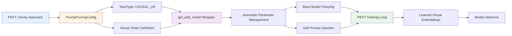

```mermaid
graph LR
    A[PEFT Library Approach] --> B[PromptTuningConfig]
    B --> C[TaskType: CAUSAL_LM]
    B --> D[Virtual Token Definition]

    C --> E[get_peft_model Wrapper]
    D --> E

    E --> F[Automatic Parameter Management]
    F --> G[Base Model Freezing]
    F --> H[Soft Prompt Injection]

    G --> I[PEFT Training Loop]
    H --> I

    I --> J[Learned Virtual Embeddings]
    J --> K[Model Inference]

    style A fill:#e3f2fd
    style B fill:#fff3e0
    style E fill:#f3e5f5
    style I fill:#e8f5e8
```